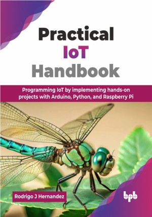

# Practical IoT Handbook

Programming IoT by implementing hands-on projects with Arduino, Python, and Raspberry Pi.

This is the repository for [Practical IoT Handbook
](https://bpbonline.com/products/practical-iot-handbook?variant=44651115380936),published by BPB Publications.

## About the Book
The field of the IoT is fundamentally reshaping how physical objects interact with digital systems through enhanced connectivity and embedded intelligence. This book serves as an indispensable resource, guiding readers through the essential principles and techniques required to unlock the full potential of IoT. From foundational concepts to the development of innovative, real-world applications, this handbook offers a structured, step-by-step approach for anyone seeking either a comprehensive introduction or an opportunity to expand their expertise in this transformative domain.

The book begins with hands-on projects that guide readers through the essentials of IoT development, combining foundational knowledge with practical application. Readers will work with popular development boards like the ESP8266, ESP32, Raspberry Pi Pico, and Raspberry Pi 4, while learning key hardware concepts and setting up a development environment using free, open-source tools such as Arduino IDE, Python, and Visual Studio Code. Core IoT topics include programming microcontrollers, interfacing with sensors and actuators, and using communication protocols like MQTT, CoAP, and HTTP. The book also covers storing and visualizing data with InfluxDB and Grafana.

By the end of this book, readers will have developed a solid foundation in IoT programming, along with the practical skills and theoretical understanding necessary to design, build, and deploy effective IoT solutions. The book prepares readers to undertake a wide range of IoT projects and contribute meaningfully to this rapidly advancing field.

## What You Will Learn
• ESP32, ESP8266, Raspberry Pi interfacing, and programming tools (Arduino, Python, VSC).

• Connect and use sensors and actuators with the microcontrollers and the Raspberry Pi 4 computer.

• Learn about open-source systems (Node-RED, InfluxDB, Grafana, Home Assistant, and OpenHAB).

• Interface diverse sensors/actuators; master GPIO, MQTT, CoAP, HTTP protocols.

• Design and implement connected systems for environmental and home automation.  
